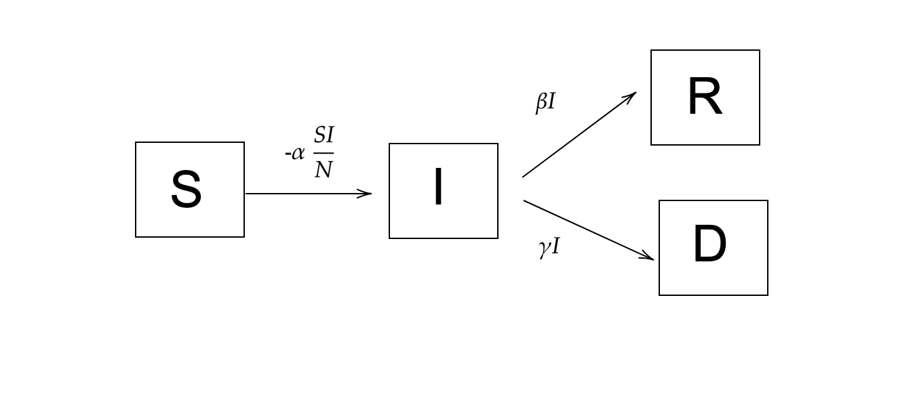

## 1. Introduction
Coronaviruses are a family of human pathogens and have been responsible for a variety of respiratory diseases in humans ranging from common cold to dangerous ones like SARS (Severe Acute Respiratory) 
and MERS (Middle East Respiratory Syndrome). At the end of 2019, a novel strain of coronavirus was identified as a casue of pneumonia-type illness in Wuhan, Hubei in China. The virus was highly contagious and rapidly spread throughout the city. Though the Chinese government ordered lockdown of the city, the virus had spread to different parts of the world resulting in a global pandemic of a massive scale in February 2020. The virus has been named as 2019-nCov and the disease has been termed as COVID-19 (Coronavirus disease 2019). 

The understanding of the virus is evolving and several models have been proposed to find the basic reproducibility number (denoted by $R_{0}$), case fatality rate and case recovery rate. In this study, we use epidemic transmission dynamics based compartmental model called ***SIRD model*** to study the progression of the disease for different countries (in particular, Germany and India). We use the discrete approximations as in [1] to estimate the $R_{0}$ , case mortality and case recovery rates and analyse the changes as time progresses. Furthermore, we fit the model to the epidemic curves of these countries to make forecasts about the peak of the epidemic and the flattening of the curve.  


```{r setup, include=FALSE}
knitr::opts_chunk$set(echo = TRUE)
library(ggplot2)
library(foreach)
library(LICORS)
library(caret)
library(reshape2)
library(olsrr)
library(scales)
```

## 2. Data visualization and exploratory analysis

The COVID-19 data used in this analysis is available on the public git repository [COVID](https://github.com/CSSEGISandData/COVID-19/tree/master/csse_covid_19_data/csse_covid_19_time_series ). The data has the time series of confirmed, recovered and death cases of COVID-19 for various countries. The first five rows of confirmed cases database look like this: 


```{r }
confirmed <- read.csv("data/time_series_covid19_confirmed_global.csv")

deaths <- read.csv("data/time_series_covid19_deaths_global.csv")

recovered <- read.csv("data/time_series_covid19_recovered_global.csv")

head(confirmed, 5)
```

We can see the data starts from January 22, 2020 and gives us the number of confirmed cases on each date since then till now. 

Below we plot the progression of the disease (confirmed, recovered, deaths) in a few selected countries.  


```{r echo=FALSE }
countries = c("Italy", "Spain", "Germany", "India", "Sweden", "Singapore", "Iran", "Korea, South")

confirmed_countries = confirmed[confirmed$Country.Region %in% countries,]
deaths_countries = deaths[deaths$Country.Region %in% countries,]
recovered_countries = recovered[recovered$Country.Region %in% countries,]


### EXTRACTING CONFIRMED DATA FOR COUNTRIES
confirmed_countries_melt = melt(confirmed_countries, id=c("Province.State", "Country.Region", "Lat", "Long"), variable.name = "Day")
confirmed_countries_melt = confirmed_countries_melt[which(confirmed_countries_melt$value > -1),]
confirmed_countries_melt$days_since = rep(1:109, each=8)
#View(confirmed_countries_melt)
#Plotting the data
ggplot(confirmed_countries_melt, aes(x=days_since, y=log(value), group=Country.Region, color=Country.Region)) +
  geom_point() +
  geom_line() + xlab("Days since Jan 22 ") + ylab("log(Confirmed cases)")  + ggtitle("Confirmed cases plot for different countries with days since Jan 22") 


###EXTRACTING RECOVERED DATA OF ITALY 
recovered_countries_melt = melt(recovered_countries, id=c("Province.State", "Country.Region", "Lat", "Long"), variable.name = "Day")
recovered_countries_melt = recovered_countries_melt[which(recovered_countries_melt$value > -1),]
recovered_countries_melt$days_since = rep(1:109, each=8)
ggplot(recovered_countries_melt, aes(x=days_since, y=log(value), group=Country.Region, color=Country.Region)) +
  geom_point() +
  geom_line() + xlab("Days since Jan 22 ") + ylab("log(Recovered cases)")  + ggtitle("Recovered cases plot for different countries with days since Jan 22") 


###EXTRACTING DEATHS DATA OF ITALY 
deaths_countries_melt = melt(deaths_countries, id=c("Province.State", "Country.Region", "Lat", "Long"), variable.name = "Day")
deaths_countries_melt = deaths_countries_melt[which(deaths_countries_melt$value > -1),]
deaths_countries_melt$days_since = rep(1:109, each=8)
ggplot(deaths_countries_melt, aes(x=days_since, y=log(value), group=Country.Region, color=Country.Region)) +
  geom_point() +
  geom_line() + xlab("Days since Jan 22 ") + ylab("log(Deaths)")  + ggtitle("Deaths plot for different countries with days since Jan 22") 


```

 We can see from the plots that South Korea has successfully flattened the curve and countries like Germany and Italy have started flattening. On the other hand, India and Singapore are still far from flattening the curve.  


## 3. Formulation of SIRD model 
 In this section, we discuss the basics of the SIRD model to simulate epidemic progression with time. 

### 3.1 Discrete model 
Within  this   model of the evolution of an epidemic outbreak, people can be divided into different classes.  In  the  susceptible  (S),  infected  (I),  recovered  (R),  dead  (D)  scheme  (SIRD),  any  individual in the fraction of the overall population that will eventually get sick belongs to one of the  aforementioned  classes.   Let N be  the  size  of  the  initial  population  of  susceptible  people. The discrete SIRD model can be written as follows: 

$$
\begin{aligned}
S(t) - S(t-1) = -\frac{\alpha}{N} S(t-1)I(t-1), \\
I(t) - I(t-1) = \frac{\alpha}{N} S(t-1)I(t-1) - \beta I(t-1) - \gamma I(t-1), \\
R(t) - R(t-1) = \beta I(t-1), \\
D(t) - D(t-1) = \gamma I(t-1),
\end{aligned}
$$

The basic reproduction number $R_{0}$ is then defined as 
$$
\begin{aligned}
R_{0} := \frac{\alpha}{\beta + \gamma}. 
\end{aligned}
$$

Since the number of susceptible people is hard to determine and depends on the population, lockdown measures, social distancing etc, we take a different approach to estimate $R_{0}$ as mentioned in Ref $1$. Let us denote $\Delta X(t) := X(t) - X(t-1)$ for $X=I, R, D$. Now we define,
$$
\begin{aligned}
C\Delta X(T) := \sum_{t=1}^{T} \Delta X(t) \textit{,     and  }\\ 
\mathbf{C \Delta X} (T) := [C\Delta X(1), C\Delta X(2), ..., C\Delta X(T)]^{T} . 
\end{aligned}
$$

Here C stands for cumulative. Using the approximation $S(t-1) \approx N$ (true if susceptible population is much less than the population of the country), we can get 
$$
\begin{aligned}
R_{0} = \frac{\alpha}{\beta + \gamma} = \frac{I(t) - I(t-1) + R(t) - R(t-1) + D(t) - D(t-1)}{R(t) - R(t-1) + D(t) - D(t-1)}.
\end{aligned}
$$
Summing this equation over time we get, 
$$
\begin{aligned}
\frac{C\Delta I(t) +C\Delta R(t) + C\Delta D(t) }{C\Delta R(t) + C \Delta D(t)} = R_{0}.
\end{aligned}
$$
Based on this, we can get a coarse estimate for $R_{0}$ by finding a least squares solution to the following regression problem:  
$$
\begin{aligned}
[\mathbf{C\Delta I(t) +C\Delta R(t) + C\Delta D(t)}] = [\mathbf{C\Delta R(t) + C \Delta D(t)}] R_{0}, 
\end{aligned}
$$
with solution given by
$$
\begin{aligned}
\hat{R}_{0} = ([\mathbf{C\Delta R(t) + C \Delta D(t)}]^{T}[\mathbf{C\Delta R(t) + C \Delta D(t)}])^{-1} [\mathbf{C\Delta R(t) + C \Delta D(t)}]^{T}  [\mathbf{C\Delta I(t) +C\Delta R(t) + C\Delta D(t)}].
\end{aligned}
$$

Similarly, the case fatality rate ($\hat{\beta}$) and case recovery rate ($\hat{\gamma}$) can be estimated as:
 $$
 \begin{aligned}
 \hat{\beta} = ([\mathbf{C\Delta I(t) }]^{T}[\mathbf{C\Delta I(t) }])^{-1} [\mathbf{C\Delta I(t)}]^{T}  [\mathbf{C\Delta R(t) }], \\
 \hat{\gamma} = ([\mathbf{C\Delta I(t) }]^{T}[\mathbf{C\Delta I(t)}])^{-1} [\mathbf{C\Delta I(t) }]^{T}  [\mathbf{ C\Delta D(t)}].
 \end{aligned}
 $$
 
 
 
 
 
 
### 3.2. Continuous model
In the continuous, the number of people in each class is a function of conitnuous time. So S(t) denotes the susceptible people at a time t. The mean-field kinetics of the SIRD epidemic evolution is described by the following system of differential equations: 

$$
\begin{aligned}
\frac{dS}{dt} = -\frac{\alpha}{N} S(t)I(t), \\
\frac{dI}{dt} = \frac{\alpha}{N} S(t)I(t) - \beta I(t) - \gamma I(t), \\
\frac{dR}{dt} = \beta I(t), \\
\frac{dD}{dt} = \gamma I(t) ,
\end{aligned}
$$


with  initial  condition  $[S(t_{0}),I(t_{0}),R(t_{0}),D(t_{0})]$ for  some  initial  time $t_{0}$.   The parameter $\alpha$ is the infection rate, i.e.  the probability per unit time that a susceptible individual contracts the disease when entering in contact with an infected person.  The parameters $\beta$ and $\gamma$ denote, respectively, the recovery and death rates. This scheme has good chances to capture at least the gross features of the full time course of the outbreak.

{Above figures shows SIRD model classes and change per unit time shown above arrows.}

## 4 Results

In this section we present our results for basic reproduction number, case fatality rate, case recovery ratios and time series forecasting for Germany and India.  

### 4.1 Results for Germany
We first use the discrete model to find these parameters and predict time series for Germany. We use the time series data available and for the required vectors $\mathbf{C\Delta X}(T)$ for $X=I, R, D$. 

```{r echo=TRUE }
country = "Germany" #Country chosen

#Extract country data from countries data
italy_cnf_melt = confirmed_countries_melt[which(confirmed_countries_melt$Country.Region == country), ]

#Extract confirmed number  as a vector
italy_cnf = italy_cnf_melt$value


#Extract delta infected vector delta_cnf(t) = I(t) - I(t-1)
italy_delta_cnf = diff(italy_cnf)


#Cumulative sum of delta_cnf
italy_cum_delta_cnf = cumsum(italy_delta_cnf)


italy_deaths_melt = deaths_countries_melt[which(deaths_countries_melt$Country.Region == country), ]

#Extract deaths number as a vector
italy_deaths = italy_deaths_melt$value


#Extract delta deathsvector delta_deaths(t) = D(t) - D(t-1)
italy_delta_deaths = diff(italy_deaths)


#Cumulative sum of delta_deaths
italy_cum_delta_deaths = cumsum(italy_delta_deaths)


#Extract Italy data from countries recovered data
italy_recovered_melt = recovered_countries_melt[which(recovered_countries_melt$Country.Region == country), ]

#Extract recovered number as a vector
italy_recovered = italy_recovered_melt$value


#Extract delta recovered vector delta_recovered(t) = R(t) - R(t-1)
italy_delta_recovered = diff(italy_recovered)


#Cumulative sum of delta_recovered
italy_cum_delta_recovered = cumsum(italy_delta_recovered)

### Caluclating infected numbers from confirmed cases
#Extract infected number cases as a vector
italy_inf = italy_cnf - italy_recovered - italy_deaths


#Extract delta infected vector delta_inf(t) = I(t) - I(t-1)
italy_delta_inf = diff(italy_inf)


#Cumulative sum of delta_inf
italy_cum_delta_inf = cumsum(italy_delta_inf)

```


We then use different time windows to estimate the time evolution of these parameters. 

```{r echo=TRUE }
###ESTIMATING CASE FATALITY RATIO

#Making data frame of cumulative data
italy_cum_data_full = data.frame(delta_inf= italy_delta_inf, cum_delta_inf=italy_cum_delta_inf, delta_recovered = italy_delta_recovered, cum_delta_recovered= italy_cum_delta_recovered, delta_deaths = italy_delta_deaths, cum_delta_deaths=italy_cum_delta_deaths)


##VARY THE NUMBER OF DAYS CHOSEN FOR ANALYSIS
ndays = 65:97
gamma_data <- data.frame(matrix(ncol = 3, nrow = 0))
x <- c("est", "lwr", "upr")
colnames(gamma_data) <- x

beta_data <- data.frame(matrix(ncol = 3, nrow = 0))
x <- c("est", "lwr", "upr")
colnames(beta_data) <- x

R0_data <- data.frame(matrix(ncol = 3, nrow = 0))
x <- c("est", "lwr", "upr")
colnames(R0_data) <- x

#loop over days window chosen
for (days in ndays) {
  
italy_cum_data = italy_cum_data_full[1:days, ]
#View(italy_cum_data)


#fitting a linear model for case fatality ratio
italy_gamma <- lm(cum_delta_deaths ~ cum_delta_inf  -1  , data=italy_cum_data)  # build linear regression model on full data


###ESTIMATING CASE  RECOVERY RATIO
cor(italy_cum_delta_inf, italy_cum_delta_recovered)
#high correlation 
#fitting a linear model for case recovery ratio
italy_beta <- lm(cum_delta_recovered ~ cum_delta_inf -1 , data=italy_cum_data)  # build linear regression model on full data with no intercept

###ESTIMATING R0
#fitting a linear model for case basic reproducibility number R0
italy_R0 <- lm(cum_delta_deaths + cum_delta_recovered + cum_delta_inf  ~ I(cum_delta_recovered + cum_delta_deaths) - 1  , data=italy_cum_data)  # build linear regression model on full data


##Storing estimations and conf intervals

conf = confint(italy_gamma)
gamma_row <- list(est = summary(italy_gamma)$coefficients[1], lwr = conf[1], upr = conf[2])


gamma_data = rbind(gamma_data, gamma_row)


conf = confint(italy_beta)
beta_row <- list(est = summary(italy_beta)$coefficients[1], lwr = conf[1], upr = conf[2])


beta_data = rbind(beta_data, beta_row)


conf = confint(italy_R0)
R0_row <- list(est = summary(italy_R0)$coefficients[1], lwr = conf[1], upr = conf[2])


R0_data = rbind(R0_data, R0_row)

}
```


We plot plot the estimates and the corresponding 99% confidence intervals  for $R_{0}, \hat{\beta}, \hat{\gamma}$ as below. 

```{r }
ggplot(R0_data, aes(ndays, est)) + geom_point() + geom_line(aes(ndays, est)) + geom_ribbon(aes(ymin=lwr,ymax=upr), alpha=0.5) + xlab("Number of days since Jan 22") + ylab("R0") + ggtitle("Germany: R0 estimate evolution ")
ggplot(beta_data, aes(ndays, est)) + geom_point() + geom_line(aes(ndays, est)) + geom_ribbon(aes(ymin=lwr,ymax=upr), alpha=0.5) + xlab("Number of days since Jan 22") + ylab("case recovery ratio") + ggtitle("Germany: case recovery ratio estimate evolution ")
ggplot(gamma_data, aes(ndays, est)) + geom_point() + geom_line(aes(ndays, est)) + geom_ribbon(aes(ymin=lwr,ymax=upr), alpha=0.5) + xlab("Number of days since Jan 22") + ylab(" case fatality ratio") + ggtitle(" Germany: case fatality ratio estimate evolution ")

```

From these, we can see that the $R_{0}$ for Germany has come down from 8.2 to 1.6 (99% CI : [1.5 1.7]). This is good news and indicates flattening of the curve. Note that if $R_{0} < 1$, the disease stops spreading. The case recovery ratio is going up and has reached approximately 0.9 while the case fatality ratio is about 0.049. We note here that since the estimate for case recovery and fatality only includes infected cases, hence the estimates for $\hat{\beta}$  and $\hat{\gamma}$ are only relibale for the early stages of the epidemic.   
 


Since $R_{0}$ is estimated by a linear model, for curiosity we carry out some diagnostics to see how if the data actually fits to the linear plot. We the plot out fitted slope (which is equal to $R_{0}$) and observe that a rather poor fit which is expected because $R_{0}$ changes with time. 

```{r}

##Predicted R0 using model
# add 'fit', 'lwr', and 'upr' columns to dataframe (generated by predict)
R0_predict <- cbind(italy_cum_data, predict(italy_R0, interval = 'confidence'))
R0_prediction = predict(italy_R0)
# plot the points (actual observations), regression line, and confidence interval
p <- ggplot(R0_predict, aes(cum_delta_recovered + cum_delta_deaths, cum_delta_recovered + cum_delta_deaths + cum_delta_inf))
p <- p + geom_point()
p <- p + geom_line(aes(cum_delta_deaths + cum_delta_recovered, R0_prediction))
p <- p + geom_ribbon(aes(ymin=lwr,ymax=upr), alpha=0.5) + ggtitle("Germany: Fitted R0 line and  actual data")
p


```

Now, we solve the actualy differential equation to fit the evolution of the disease and forecast the time series.  We intialize the values below. We ignore the initial data because of noisiness and low scale testing. 

```{r}
library(deSolve)
library(RColorBrewer)

Infected <- italy_inf[50:97]
Recovered <- italy_recovered[50:97]
Deaths <- italy_deaths[50:97]
Confirmed <- italy_cnf[50:97]
day <- 0:(length(Infected)-1)
N <- 830000 


###edit 1: use different boundary condition
###init <- c(S = N-1, I = 1, R = 0)
init <- c(S = N-Infected[1] - Recovered[1] - Deaths[1], I = Infected[1], R = Recovered[1], D = Deaths[1])
```

Then, we define the differential changes in the quantities with respect to time.  


```{r}

SIR <- function(time, state, parameters) {
  par <- as.list(c(state, parameters))
  ####edit 2; use equally scaled variables 
  with(par, { dS <- -alpha * (S/N) * I
  dI <- alpha * (S/N) * I - beta * I - gamma * I
  dR <- beta * I
  dD <- gamma * I
  list(c(dS, dI, dR, dD))
  })
}
```

Then we define an optimizer to find the optimum parameters to fit the confirmed cases curve with an initial guess. For this we also define a misfit function which is a simple L2 error function. The code is given below. 

```{r}
RSS.SIR <- function(parameters) {
  names(parameters) <- c("alpha", "beta", "gamma")
  out <- ode(y = init, times = day, func = SIR, parms = parameters)
  fit <- out[ , 3] + out[ , 4] + out[ , 5]
  RSS <- sum((Confirmed- fit)^2)
  return(RSS)
}

lower = c(0, 0, 0)
upper = c(10, 1, 1)  ###Limit box for parameters for L-BFGS-B


optimsstart <- c(0.7, 0.4,  0.2) #initial guess for parameters

set.seed(12)
Opt <- optim(optimsstart, RSS.SIR, method = "L-BFGS-B", lower = lower, upper = upper,
             hessian = TRUE)
#Opt$par

```

Once we have optimized, we can predict the case evolution as follows.    
```{r}

Opt_par <- Opt$par
names(Opt_par) = c("alpha", "beta", "gamma")
t <- 0:120
fit <- data.frame(ode(y = init, times = t, func = SIR, parms = Opt_par))
predict <- fit$I + fit$D + fit$R
plot(t, predict, col="green", xlab="Days since March 11", ylab="Confirmed cases")  
lines(day, Confirmed, col="red")
title("Germany: Green is confirmed cases predicted by our model, red is actual data.")
```


The results indicate that by the end of June, the confirmed cases will peak and the epidemic will end in Germany.


### 4.2 Results for India

Now we repeat the same analysis for India. Note India is still in the early phase of the disease.


```{r echo=FALSE }
country = "India" #Country chosen

#Extract country data from countries data
italy_cnf_melt = confirmed_countries_melt[which(confirmed_countries_melt$Country.Region == country), ]

#Extract confirmed number  as a vector
italy_cnf = italy_cnf_melt$value


#Extract delta infected vector delta_cnf(t) = I(t) - I(t-1)
italy_delta_cnf = diff(italy_cnf)


#Cumulative sum of delta_cnf
italy_cum_delta_cnf = cumsum(italy_delta_cnf)


italy_deaths_melt = deaths_countries_melt[which(deaths_countries_melt$Country.Region == country), ]

#Extract deaths number as a vector
italy_deaths = italy_deaths_melt$value


#Extract delta deathsvector delta_deaths(t) = D(t) - D(t-1)
italy_delta_deaths = diff(italy_deaths)


#Cumulative sum of delta_deaths
italy_cum_delta_deaths = cumsum(italy_delta_deaths)


#Extract Italy data from countries recovered data
italy_recovered_melt = recovered_countries_melt[which(recovered_countries_melt$Country.Region == country), ]

#Extract recovered number as a vector
italy_recovered = italy_recovered_melt$value


#Extract delta recovered vector delta_recovered(t) = R(t) - R(t-1)
italy_delta_recovered = diff(italy_recovered)


#Cumulative sum of delta_recovered
italy_cum_delta_recovered = cumsum(italy_delta_recovered)

### Caluclating infected numbers from confirmed cases
#Extract infected number cases as a vector
italy_inf = italy_cnf - italy_recovered - italy_deaths


#Extract delta infected vector delta_inf(t) = I(t) - I(t-1)
italy_delta_inf = diff(italy_inf)


#Cumulative sum of delta_inf
italy_cum_delta_inf = cumsum(italy_delta_inf)

```


```{r echo=FALSE }
###ESTIMATING CASE FATALITY RATIO

#Making data frame of cumulative data
italy_cum_data_full = data.frame(delta_inf= italy_delta_inf, cum_delta_inf=italy_cum_delta_inf, delta_recovered = italy_delta_recovered, cum_delta_recovered= italy_cum_delta_recovered, delta_deaths = italy_delta_deaths, cum_delta_deaths=italy_cum_delta_deaths)


##VARY THE NUMBER OF DAYS CHOSEN FOR ANALYSIS
ndays = 65:97
gamma_data <- data.frame(matrix(ncol = 3, nrow = 0))
x <- c("est", "lwr", "upr")
colnames(gamma_data) <- x

beta_data <- data.frame(matrix(ncol = 3, nrow = 0))
x <- c("est", "lwr", "upr")
colnames(beta_data) <- x

R0_data <- data.frame(matrix(ncol = 3, nrow = 0))
x <- c("est", "lwr", "upr")
colnames(R0_data) <- x

#loop over days window chosen
for (days in ndays) {
  
italy_cum_data = italy_cum_data_full[1:days, ]
#View(italy_cum_data)


#fitting a linear model for case fatality ratio
italy_gamma <- lm(cum_delta_deaths ~ cum_delta_inf  -1  , data=italy_cum_data)  # build linear regression model on full data


###ESTIMATING CASE  RECOVERY RATIO
cor(italy_cum_delta_inf, italy_cum_delta_recovered)
#high correlation 
#fitting a linear model for case recovery ratio
italy_beta <- lm(cum_delta_recovered ~ cum_delta_inf -1 , data=italy_cum_data)  # build linear regression model on full data with no intercept

###ESTIMATING R0
#fitting a linear model for case basic reproducibility number R0
italy_R0 <- lm(cum_delta_deaths + cum_delta_recovered + cum_delta_inf  ~ I(cum_delta_recovered + cum_delta_deaths) - 1  , data=italy_cum_data)  # build linear regression model on full data


##Storing estimations and conf intervals

conf = confint(italy_gamma)
gamma_row <- list(est = summary(italy_gamma)$coefficients[1], lwr = conf[1], upr = conf[2])


gamma_data = rbind(gamma_data, gamma_row)


conf = confint(italy_beta)
beta_row <- list(est = summary(italy_beta)$coefficients[1], lwr = conf[1], upr = conf[2])


beta_data = rbind(beta_data, beta_row)


conf = confint(italy_R0)
R0_row <- list(est = summary(italy_R0)$coefficients[1], lwr = conf[1], upr = conf[2])


R0_data = rbind(R0_data, R0_row)

}
```


We plot plot the estimates and the corresponding 99% confidence intervals  for $R_{0}, \hat{\beta}, \hat{\gamma}$ as below. 

```{r echo=FALSE}
ggplot(R0_data, aes(ndays, est)) + geom_point() + geom_line(aes(ndays, est)) + geom_ribbon(aes(ymin=lwr,ymax=upr), alpha=0.5) + xlab("Number of days since Jan 22") + ylab("R0") + ggtitle("India:R0 estimate evolution ")
ggplot(beta_data, aes(ndays, est)) + geom_point() + geom_line(aes(ndays, est)) + geom_ribbon(aes(ymin=lwr,ymax=upr), alpha=0.5) + xlab("Number of days since Jan 22") + ylab("case recovery ratio") + ggtitle("India: case recovery ratio estimate evolution ")
ggplot(gamma_data, aes(ndays, est)) + geom_point() + geom_line(aes(ndays, est)) + geom_ribbon(aes(ymin=lwr,ymax=upr), alpha=0.5) + xlab("Number of days since Jan 22") + ylab(" case fatality ratio") + ggtitle("India: case fatality ratio estimate evolution ")

```

From these, we can see that the $R_{0}$ for India has come down from 10.6 to 4.09 (99% CI : [3.94 4.25]). Thus India is quite far away from the end of the epidemic. Note that if $R_{0} < 1$, the disease stops spreading. The case recovery ratio is going up and has reached approximately 0.26 while the case fatality ratio is about 0.041.   
 


Since $R_{0}$ is estimated by a linear model, for curiosity we carry out some diagnostics to see how if the data actually fits to the linear plot. We the plot out fitted slope (which is equal to $R_{0}$) and observe that a rather poor fit which is expected because $R_{0}$ changes with time. 

```{r echo=FALSE}

##Predicted R0 using model
# add 'fit', 'lwr', and 'upr' columns to dataframe (generated by predict)
R0_predict <- cbind(italy_cum_data, predict(italy_R0, interval = 'confidence'))
R0_prediction = predict(italy_R0)
# plot the points (actual observations), regression line, and confidence interval
p <- ggplot(R0_predict, aes(cum_delta_recovered + cum_delta_deaths, cum_delta_recovered + cum_delta_deaths + cum_delta_inf))
p <- p + geom_point()
p <- p + geom_line(aes(cum_delta_deaths + cum_delta_recovered, R0_prediction))
p <- p + geom_ribbon(aes(ymin=lwr,ymax=upr), alpha=0.5) + ggtitle("Fitted R0 line and  actual data for India")
p


```

 

We solve the differntial equations system and fit the parameters to do time series forecasting for the India data. 
```{r echo=FALSE}
library(deSolve)
library(RColorBrewer)

Infected <- italy_inf[65:97]
Recovered <- italy_recovered[65:97]
Deaths <- italy_deaths[65:97]
Confirmed <- italy_cnf[65:97]
day <- 0:(length(Infected)-1)
N <- 1000000 


###edit 1: use different boundary condition
###init <- c(S = N-1, I = 1, R = 0)
init <- c(S = N-Infected[1] - Recovered[1] - Deaths[1], I = Infected[1], R = Recovered[1], D = Deaths[1])
```


```{r echo=FALSE}

SIR <- function(time, state, parameters) {
  par <- as.list(c(state, parameters))
  ####edit 2; use equally scaled variables 
  with(par, { dS <- -alpha * (S/N) * I
  dI <- alpha * (S/N) * I - beta * I - gamma * I
  dR <- beta * I
  dD <- gamma * I
  list(c(dS, dI, dR, dD))
  })
}
```


```{r echo=FALSE}
RSS.SIR <- function(parameters) {
  names(parameters) <- c("alpha", "beta", "gamma")
  out <- ode(y = init, times = day, func = SIR, parms = parameters)
  fit <- out[ , 3] + out[ , 4] + out[ , 5]
  RSS <- sum((Confirmed- fit)^2)
  return(RSS)
}

lower = c(0, 0, 0)
upper = c(10, 1, 1)  ###limit box for parameters for L-BFGS-B

### edit: get a good starting condition
#mod <- nls(Infected ~ a*exp(b*day),            start = list(a = Infected[20],  b = (1/20)*log(Infected[40]/Infected[40])))
#optimsstart <- c(2,1)*coef(mod)[2]

optimsstart <- c(0.7, 0.4,  0.2) #initial guess for parameters

set.seed(12)
Opt <- optim(optimsstart, RSS.SIR, method = "L-BFGS-B", lower = lower, upper = upper,
             hessian = TRUE)
#Opt$par

```

Once we have optimized, we can predict the case evolution as follows.    
```{r echo=FALSE}

Opt_par <- Opt$par
names(Opt_par) = c("alpha", "beta", "gamma")
t <- 0:120
fit <- data.frame(ode(y = init, times = t, func = SIR, parms = Opt_par))
predict <- fit$I + fit$D + fit$R
plot(t, predict, col="green", xlab="Days since March 26", ylab="Confirmed cases")  
lines(day, Confirmed, col="red")
title("Green is confirmed cases predicted by our model for India, red is actual data.")
```


The results indicate that the curve will peak in India by the end of July.

## 5. Conclusions and Future work
In this study, we used SIRD model commonly used in epidemiology to estimate the evolution of basic reprducibility number, case fatality ratio and case recovery ratio as the disease progresses. We also use it to fit the parameters to the data coming from Germany and India and use it to predict the evolution of disease. Our results indicate that the epidemic should end in germany by the end of June. India might have to wait till the end of July before the peak is reached. The recovery ratios obtained for India (about 26%) are consistent with the government estimates recently reported in [business-standard](https://www.business-standard.com/article/current-affairs/covid-19-factoid-india-s-recovery-rate-improves-to-30-from-10-in-april-120050900106_1.html) . The prediction of beginning of curve flattening by July end are in line with the recent WHO estimates given [WHO envoy interview](https://www.ndtv.com/india-news/indias-covid-curve-likely-to-flatten-reach-peak-by-july-end-who-envoy-2225754). 

## 6. Limitations
However, we must state here that there are several limitations to our predictions. First, the model itself is a simplistic model to study the disease as it assumes constant transmission rates among different classes. Also, the model does not take into account the asymptomatic cases which may be contributing to sopreading the disease. Secondly, the data itself might be unreliable as there might be severe underreporting of infected people because of lack of testing. Thirdly, the uplifting of lockdown may accelerate the spread of disease. A more complex model with these factors taken into account would be desirable for a better forecasting. 

## 7. References

[1] Cleo Anastassopoulou ,Lucia Russo,Athanasios Tsakris, Constantinos Siettos,"
Data-based analysis, modelling and forecasting of the COVID-19 outbreak", PLOS ONE (2020)  (https://doi.org/10.1371/journal.pone.0230405)
