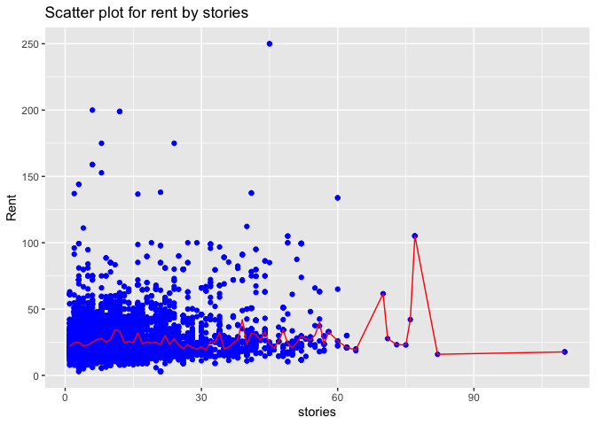

    library(mosaic)
    library(tidyverse)
    library("ggplot2")

    #Reading the data
    gb = read.csv('../data/greenbuildings.csv')
    #summary(gb);
    str(gb)

    ## 'data.frame':    7894 obs. of  23 variables:
    ##  $ CS_PropertyID    : int  379105 122151 379839 94614 379285 94765 236739 234578 42087 233989 ...
    ##  $ cluster          : int  1 1 1 1 1 1 6 6 6 6 ...
    ##  $ size             : int  260300 67861 164848 93372 174307 231633 210038 225895 912011 518578 ...
    ##  $ empl_gr          : num  2.22 2.22 2.22 2.22 2.22 2.22 4.01 4.01 4.01 4.01 ...
    ##  $ Rent             : num  38.6 28.6 33.3 35 40.7 ...
    ##  $ leasing_rate     : num  91.4 87.1 88.9 97 96.6 ...
    ##  $ stories          : int  14 5 13 13 16 14 11 15 31 21 ...
    ##  $ age              : int  16 27 36 46 5 20 38 24 34 36 ...
    ##  $ renovated        : int  0 0 1 1 0 0 0 0 0 1 ...
    ##  $ class_a          : int  1 0 0 0 1 1 0 1 1 1 ...
    ##  $ class_b          : int  0 1 1 1 0 0 1 0 0 0 ...
    ##  $ LEED             : int  0 0 0 0 0 0 0 0 0 0 ...
    ##  $ Energystar       : int  1 0 0 0 0 0 1 0 0 0 ...
    ##  $ green_rating     : int  1 0 0 0 0 0 1 0 0 0 ...
    ##  $ net              : int  0 0 0 0 0 0 0 0 0 0 ...
    ##  $ amenities        : int  1 1 1 0 1 1 1 1 1 1 ...
    ##  $ cd_total_07      : int  4988 4988 4988 4988 4988 4988 2746 2746 2746 2746 ...
    ##  $ hd_total07       : int  58 58 58 58 58 58 1670 1670 1670 1670 ...
    ##  $ total_dd_07      : int  5046 5046 5046 5046 5046 5046 4416 4416 4416 4416 ...
    ##  $ Precipitation    : num  42.6 42.6 42.6 42.6 42.6 ...
    ##  $ Gas_Costs        : num  0.0137 0.0137 0.0137 0.0137 0.0137 ...
    ##  $ Electricity_Costs: num  0.029 0.029 0.029 0.029 0.029 ...
    ##  $ cluster_rent     : num  36.8 36.8 36.8 36.8 36.8 ...

    #quantile(gb$leasing_rate, probs=c(0.01, 0.05, 0.1, 0.15, 0.2)) # to get an idea of quantiles

1)Occupancy levels plot. Note for all the plots below, blue plots are
for all buildings, green for only green buildings and red are for non
green buildings.  
1.1) We verify that the below 10% occupancy level buildings are not
significant. The median occupancy level is 89% for non green buildings
while 93% for green. Box plot gives good confidence to the expectation
of 90% occupancy level.

    par(mfrow = c(2, 2)) # Create a 2 x 2 plotting matrix
    hist(gb$leasing_rate, xlab="Occupancy level", main="Occupancy level histogram", col="blue") #plot histogram of occupancy level in percentage

    ##Now plotting only green buildings occupancy level

    gb_green = gb %>% filter(gb$green_rating > 0.5)
    #summary(gb_green)

    hist(gb_green$leasing_rate, xlab="Green buildings occupancy level", main="Green buildings occupancy level histogram", col="green") #plot histogram of occupancy level in percentage

    ##Now plotting only non green buildings occupancy level

    gb_nongreen = gb %>% filter(gb$green_rating < 0.5)
    #summary(gb_nongreen)

    hist(gb_nongreen$leasing_rate, xlab="Non-green buildings occupancy level", main="Non-green buildings occupancy level histogram", col="red") #plot histogram of occupancy level in percentage

    boxplot(gb$leasing_rate, gb_green$leasing_rate, gb_nongreen$leasing_rate, names=c("All", "green", "non-green"), col = c("blue", "green", "red"), main = "Occupancy levels box plot", outline=TRUE)

2)Occupancy levels by cluster id

2.1) Since the building’s location is specified, it is important to see
if the occupancy rate depends on the location. The plot shows similar
distribution for all clusters, indicating negligible dependency of
occupancy based on the location.

    plot(gb$cluster, gb$leasing_rate,  main = "Occupancy levels by cluster", xlab="cluster id", ylab="occupancy level", col="blue")

    # ggplot(data = gb) +
    #   geom_point(mapping = aes(y = leasing_rate, x= cluster), col="blue") +
    #   stat_summary(aes(y = leasing_rate,x=cluster), fun.y=median, colour="red", geom="line",group=1) +
    #   labs(title="Scatter plot for rent by stories")

3)Occupancy levels by storeys

3.1) Note the building proposed is 15 stories, so we check median
occupancy for around 15 storey buildings with median level indicated in
red. The median leasing rate for 15 storey buildings is slightly more
than 75% so while 90% is assumed in the analysis. Even with 75%
occupancy, we can recuperate the extra cost in 10.25 years, which is
only about 1/3 of expected total lifetime.

    # plot(gb$stories, gb$leasing_rate,  main = "Occupancy levels by stories", xlab="stories", ylab="occupancy level", col="blue")
    # plot(gb_green$stories, gb_green$leasing_rate,  main = "Green building occupancy ", xlab="stories", ylab="occupancy level", col="green")
    # 
    # plot(gb_nongreen$stories, gb_nongreen$leasing_rate,  main = "Non green buildings occupancy ", xlab="stories", ylab="occupancy level", col="red")

    ggplot(data = gb) +
      geom_point(mapping = aes(y = leasing_rate, x= stories), col="blue") +
      stat_summary(aes(y = leasing_rate,x=stories), fun.y=median, colour="red", geom="line",group=1) +
      labs(title="Scatter plot for occupancy level by stories with median level indicated in red")

1.  Rent distribution of green and non green buildings. The median rent
    of green buildings is higher. For both green and nongreen, the
    quantiles are close together with outliers mostly having much higher
    rents. So it is reasonable to assume the rent for green building
    will be around $2.6 higher than non green ones.

<!-- -->

    boxplot(gb$Rent, gb_green$Rent, gb_nongreen$Rent, names=c("All", "green", "non-green"), col = c("blue", "green", "red"), main = "Rent box plot", outline=TRUE)  

1.  We also check to see if rent depends on the number of stories. While
    the data is sparse for higher storey buildings, the median line in
    red remains at the same level. Hence, we can conclude there is not
    much dependency of the rent on the number of stories.

<!-- -->

    ggplot(data = gb) +
      geom_point(mapping = aes(y = Rent, x= stories), col="blue") +
      stat_summary(aes(y = Rent,x=stories), fun.y=median, colour="red", geom="line",group=1) +
      labs(title="Scatter plot for rent by stories")

