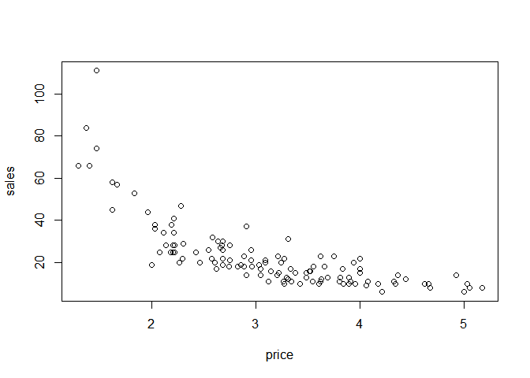
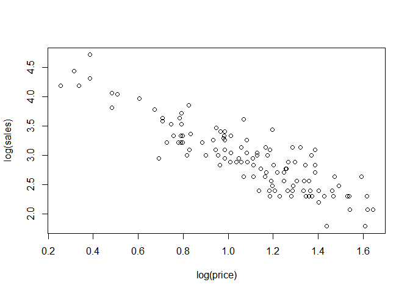
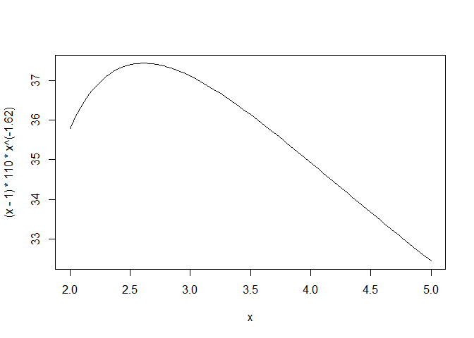
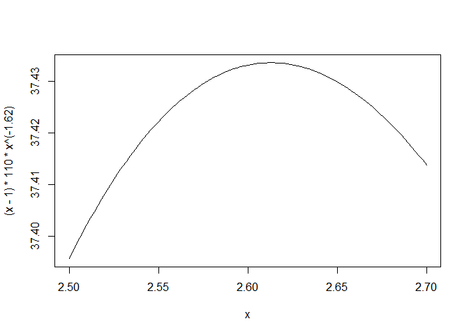

Milk Prices Case Study
======================

The data in milk.csv contains a random sample of daily sales figures for
a small neighborhood grocery store of cartons of milk.The "price" column
gives the price at which the milk was sold that day and the "sales"
column says how many units were sold that day. The store's wholesale
cost of milk is c dollars per carton. As the merchants, we want to
maximize profit. Assuming that P is "price charged", Q is "quanity
sold", N is "net or gross profit" and "c" is whole sale cost. Gross
Profit will be the profit we will make on each item sold times the
number of items sold. Hence our equation is N=(P-c)\*Q. We need to
maximize this equation but we can not use calculus to maximize it
becasue we if we try to take the derivative dN/dp and set it equal to 0
then we run into the problem of price and quantitiy being coupled in
this equation. So as we increase the price people demand less. Thus our
equation is (P-C) times f(p) since Q=f(p). We have to estimate f(p)
which is the demand curve. The estimate of the demand curve is in a
power law format so we have Q = alpha times Price raised to the power
beta. Here beta is the price elasticity of demand. To fit the power law
equation we take the log of both sides of our equation and we have
log(Q) = log(alpha) + beta (log(P)). This is a linear function, in
log(Q) versus log(P) so we can use the lm fuction to estimate the value
of alpha and beta. As you can see from the R out that alpha = 4.721 and
beta = -1.619. Hence our equation is Q = e4.721-p(-1.619).
This gives total gross profit of N = (P-C) (e4.7(P(-1.62)).As
per question, c = 1. So our equation becomes N =
Q(p)(P-C)=(e4.721-p(-1.619))(P-1). Lastly, now that we have
our gross profit function, we can use calculus or as simply told in
class, plot and point to the maximum. The plot is shown, and the ideal
price found is 2.61 dollars.

    library(mosaic)

    ## Warning: package 'mosaic' was built under R version 3.6.2

    ## Loading required package: dplyr

    ## 
    ## Attaching package: 'dplyr'

    ## The following objects are masked from 'package:stats':
    ## 
    ##     filter, lag

    ## The following objects are masked from 'package:base':
    ## 
    ##     intersect, setdiff, setequal, union

    ## Loading required package: lattice

    ## Loading required package: ggformula

    ## Loading required package: ggplot2

    ## Loading required package: ggstance

    ## Warning: package 'ggstance' was built under R version 3.6.2

    ## 
    ## Attaching package: 'ggstance'

    ## The following objects are masked from 'package:ggplot2':
    ## 
    ##     geom_errorbarh, GeomErrorbarh

    ## 
    ## New to ggformula?  Try the tutorials: 
    ##  learnr::run_tutorial("introduction", package = "ggformula")
    ##  learnr::run_tutorial("refining", package = "ggformula")

    ## Loading required package: mosaicData

    ## Warning: package 'mosaicData' was built under R version 3.6.2

    ## Loading required package: Matrix

    ## Registered S3 method overwritten by 'mosaic':
    ##   method                           from   
    ##   fortify.SpatialPolygonsDataFrame ggplot2

    ## 
    ## The 'mosaic' package masks several functions from core packages in order to add 
    ## additional features.  The original behavior of these functions should not be affected by this.
    ## 
    ## Note: If you use the Matrix package, be sure to load it BEFORE loading mosaic.

    ## 
    ## Attaching package: 'mosaic'

    ## The following object is masked from 'package:Matrix':
    ## 
    ##     mean

    ## The following object is masked from 'package:ggplot2':
    ## 
    ##     stat

    ## The following objects are masked from 'package:dplyr':
    ## 
    ##     count, do, tally

    ## The following objects are masked from 'package:stats':
    ## 
    ##     binom.test, cor, cor.test, cov, fivenum, IQR, median, prop.test,
    ##     quantile, sd, t.test, var

    ## The following objects are masked from 'package:base':
    ## 
    ##     max, mean, min, prod, range, sample, sum

    library(tidyverse)

    ## Warning: package 'tidyverse' was built under R version 3.6.2

    ## -- Attaching packages ---------------------------------------------------------------------------------------------------------------- tidyverse 1.3.0 --

    ## <U+2713> tibble  2.1.3     <U+2713> purrr   0.3.3
    ## <U+2713> tidyr   1.0.0     <U+2713> stringr 1.4.0
    ## <U+2713> readr   1.3.1     <U+2713> forcats 0.4.0

    ## -- Conflicts ------------------------------------------------------------------------------------------------------------------- tidyverse_conflicts() --
    ## x mosaic::count()            masks dplyr::count()
    ## x purrr::cross()             masks mosaic::cross()
    ## x mosaic::do()               masks dplyr::do()
    ## x tidyr::expand()            masks Matrix::expand()
    ## x dplyr::filter()            masks stats::filter()
    ## x ggstance::geom_errorbarh() masks ggplot2::geom_errorbarh()
    ## x dplyr::lag()               masks stats::lag()
    ## x tidyr::pack()              masks Matrix::pack()
    ## x mosaic::stat()             masks ggplot2::stat()
    ## x mosaic::tally()            masks dplyr::tally()
    ## x tidyr::unpack()            masks Matrix::unpack()

    milk <- read.csv("milk.csv")

    plot(sales~price, milk)

    plot(log(sales)~log(price), milk)

    ped <- lm(log(sales) ~ log(price), milk)
    ped

    ## 
    ## Call:
    ## lm(formula = log(sales) ~ log(price), data = milk)
    ## 
    ## Coefficients:
    ## (Intercept)   log(price)  
    ##       4.721       -1.619

    # log(Q)=4.7-1.62log(p)
    ##Q = (e^4.7)p^-1.62

    curve((x-1)*110*x^(-1.62), from=2, to=5)

    curve((x-1)*110*x^(-1.62), from=2.5, to=2.7)

