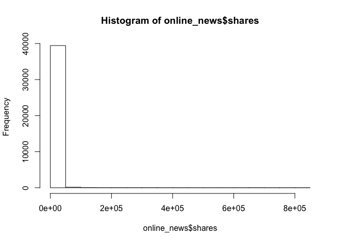
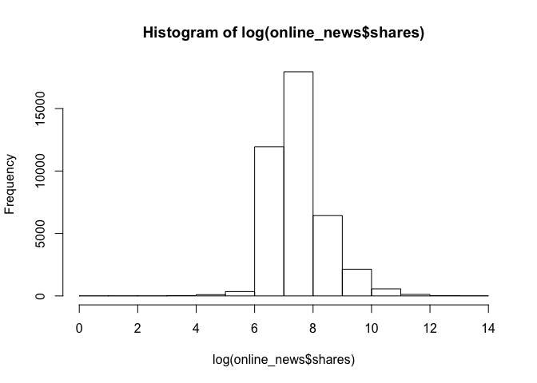
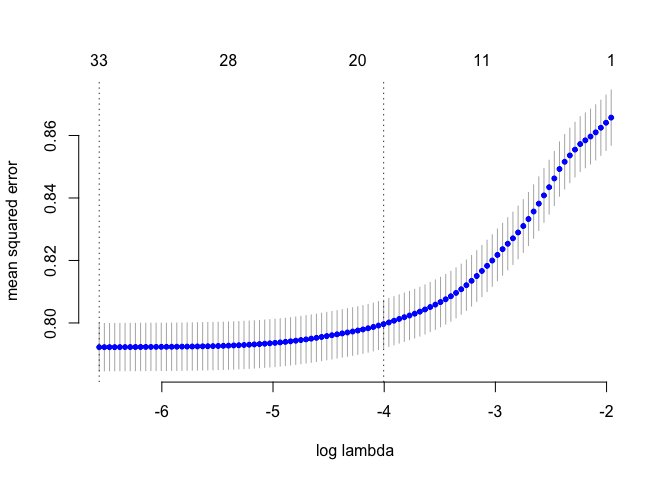
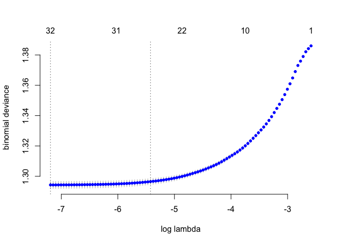

Classifying mashable articles as viral and not viral based on given features.
=============================================================================

Apart from the trivial null model of predicting every article as non
viral, two models are built:

1.  Model 1: regress to fit log(shares) and then threshold it to
    classify as viral or not viral and,  
2.  Model 2: directly do a logistic regression to predict whether it is
    viral or not.

For both models, lasso regression with cross validation is used to
minimize deviance with penalty term while avoiding overfitting and
enabling automatic variable selection.

Summary of the results
======================

### Confusion matrix of NULL model

<table>
<thead>
<tr class="header">
<th></th>
<th>Actual viral</th>
<th>Actual non-viral</th>
</tr>
</thead>
<tbody>
<tr class="odd">
<td>Predicted viral</td>
<td>0</td>
<td>0</td>
</tr>
<tr class="even">
<td>Predicted non-viral</td>
<td>19563</td>
<td>20082</td>
</tr>
</tbody>
</table>

### Confusion matrix of model 1

<table>
<thead>
<tr class="header">
<th></th>
<th>Actual viral</th>
<th>Actual non viral</th>
</tr>
</thead>
<tbody>
<tr class="odd">
<td>Preicted Viral</td>
<td>17551</td>
<td>15261</td>
</tr>
<tr class="even">
<td>Predicted non-viral</td>
<td>2011</td>
<td>4821</td>
</tr>
</tbody>
</table>

### Confusion matrix of model 2

<table>
<thead>
<tr class="header">
<th></th>
<th>Actual Viral</th>
<th>Actual non-viral</th>
</tr>
</thead>
<tbody>
<tr class="odd">
<td>Predicted viral</td>
<td>12374</td>
<td>7492</td>
</tr>
<tr class="even">
<td>Predicted non-viral</td>
<td>7188</td>
<td>12590</td>
</tr>
</tbody>
</table>

### Table of summary of models

<table>
<thead>
<tr class="header">
<th>Model</th>
<th>Overall Accuracy</th>
<th>TPR</th>
<th>FPR</th>
<th>FDR</th>
<th></th>
</tr>
</thead>
<tbody>
<tr class="odd">
<td>Null</td>
<td>50.66</td>
<td>0</td>
<td>0</td>
<td>undefined</td>
<td></td>
</tr>
<tr class="even">
<td>Model 1</td>
<td>56.8</td>
<td>89.7</td>
<td>76</td>
<td>46.5</td>
<td></td>
</tr>
<tr class="odd">
<td>Model 2</td>
<td>63</td>
<td>63.2</td>
<td>37.3</td>
<td>37.7</td>
<td></td>
</tr>
</tbody>
</table>

***Conclusion:*** From the table, the overall accuracy rates indicate
that **model 2 (direct logistic regression with lasso)** performs better
than **model 1 (regress then threshold)** while both perform better than
the null model. Model 2 is 6% better than model 1 and 13% better than
null model. Althought the TPR for the model 1 is much higher than the
model 2, FPR and FDR are much lower for model 2. Thus, overall model 2
performs better than model 1.

***Reason:*** The reason why logistic regression works better for
classification is that it handles the imbalance in the data well and is
not too sensitive to adding or removing input data. Due to flat tails of
the logit link and sharp increase in the middle, it handles the
classification problem better than just fitting a linear model and
thresholding.

    ## fold 1,2,3,4,5,6,7,8,9,10,done.

    ## [1] -6.563407

    ## [1] 33

    ##    yhat
    ## y       0     1
    ##   0  4936 15146
    ##   1  2057 17505

    ## [1] 0.566063

    ## fold 1,2,3,4,5,6,7,8,9,10,done.

    ## [1] -7.190693

    ## [1] 32

    ##    yhat
    ## y       0     1
    ##   0 18390  1692
    ##   1 14894  4668

    ## [1] 0.5816265

    ## viral
    ##     0     1 
    ## 20082 19562

    ## [1] 0.5065584

    ##    yhat
    ## y       0     1
    ##   0  4936 15146
    ##   1  2057 17505

    ## [1] 0.566063

    ##    yhat
    ## y       0     1
    ##   0 18390  1692
    ##   1 14894  4668

    ## [1] 0.5816265
