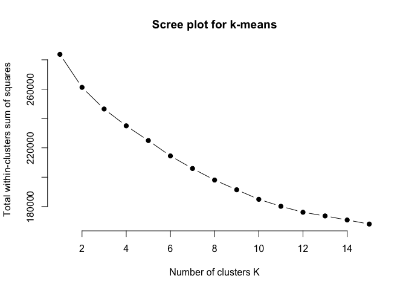
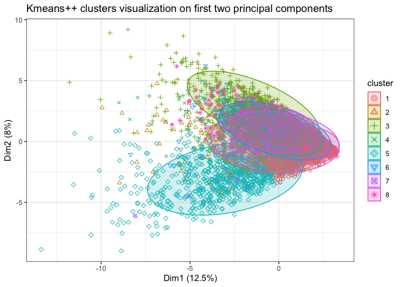
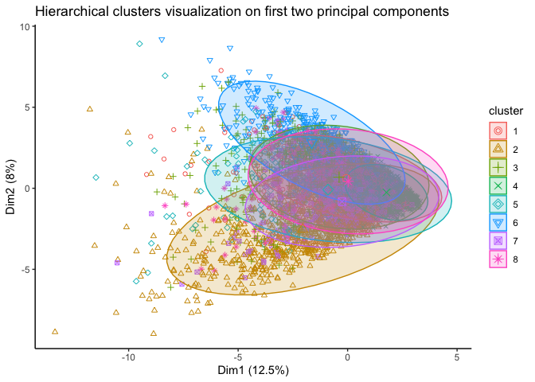
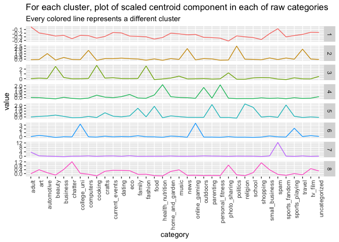
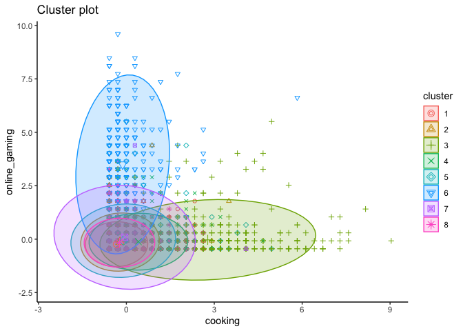
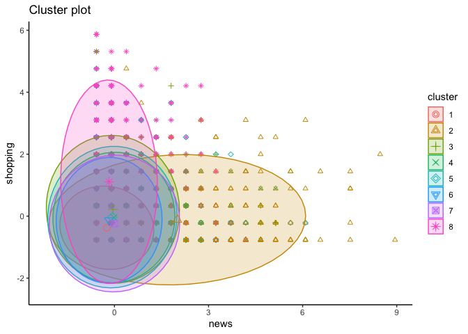

### Problem statement

Twitter tweets from the followers of a consumer brand were analyzed.
Every tweet has been classified as belonging to a category like sports,
cooking, beauty, fitness etc. by annotators.

These tweets can help in market segmentation i.e., to classify social
market into segments to help understand the customer base better in
terms of their interests, preferences, social media activity etc. This
can help in targeted advertisement campaigns, better reach to customers,
tweak promotional offers according to customers etc., in effect helping
the business to grow.

Our task here to is to identify these segments based on intuition and
sound data analysis and interpret them in a coherent manner.

### Steps

The broad outline of the approach we took to carry out this task as
follows:

#### 1. Exploratory data analysis

We find out that the data has 36 features available for each user. These
36 features specify the number of tweets in each category (like
online\_gaming, politics, cooking etc.) by that user. It is intuitive to
first check for correlation between these features as that can help us
in finding out correlated features. Since correlation is not sensitive
to scaling, we just run plot correlation for the raw data.

    sm_data <- read.csv("social_marketing.csv")
    #summary(sm_data)
    #head(sm_data, 10)

    sm_feat_raw <- sm_data[,2:length(sm_data)]

    # Creating a correlation plot 

    cormat <- round(cor(sm_feat_raw), 2)
    #head(cormat[, 1:6])
    ggcorrplot(cormat, hc.order = TRUE, 
               type = "lower", 
               outline.color = "white") + theme( axis.text.x = element_text(angle=90, hjust=1))

Correlation plot reveals some interesting and intutitive correlations
between features. Some very strong +ve correlations can be seen, like
between health nutrition and personal fitness, cooking and fashion,
online\_gaming and college\_uni. These are intuitive like people who are
interested in health\_nutrition also are likely to tweet about personal
fitness. A rather peculiar one is between sports\_fandom and religion
which doesn’t seem so intuitive. (Maybe if you are a fan of God, you are
likely to be a fan of sports team :) ).

### 2. Segmentation using clustering approach

In order to see if these features and correlation can help to identify
some interesting groups of users with shared features, we decide to try
the clustering approach to help identify some number of clusters. We
decide to go for the KMeans++ clustering approach. The first step in
this clustering is to scale the data to zero mean and unit variance of
the columns. This will even out the intrinsic variations in the features
data and help us in clustering.

    sm_user <- sm_data[, 1]

    # Scaling and centering data
    sm_sca = scale(sm_feat_raw, center=TRUE, scale=TRUE)

#### 2.1 Finding an optimal number of clusters: Scree analysis, silhouette method, gap statistic

For kmeans++ clustering, we need to give the number of clusters
beforehand. So we do a scree analysis, silhouette analysis and gap
statistic analysis to see if that gives meaningful number of clusters.

    set.seed(100)

    # function to compute total within-cluster sum of square
    wss <- function(k) {
      kmeans(sm_sca, k, nstart = 10 )$tot.withinss
    }

    # Compute and plot wss for k = 1 to k = 15
    k.values <- 1:15

    # extract wss for 2-15 clusters
    wss_values <- map_dbl(k.values, wss)

    scree = plot(k.values, wss_values,
         type="b", pch = 19, frame = FALSE,
         xlab="Number of clusters K",
         ylab="Total within-clusters sum of squares",
         main = "Scree plot for k-means")

    sil = fviz_nbclust(sm_sca, kmeans, method = "silhouette")
    plot(sil, main = "Silhouette analysis for k-means")

    #  set.seed(123)
    #  gap_stat <- clusGap(sm_sca, FUN = kmeans, nstart = 10,
    #                      K.max = 18, B = 10)
    # 
    # gap = fviz_gap_stat(gap_stat)

***Inference on number of clusters:*** Scree plot doesn’t have any elbow
to conclude anything meaningful about number of clusters. Since within
cluster sum of squares keeps on decreasing, it rather suggests higher
the better. The silhouette method tells the optimum number of clusters
to be 2, it is too low for any meaningful analysis. So we tried a
reasonable numbers like 6 and 8 which are feasible enough for market
segmentation point of view and see if we can interpret the clusters.
***Here we present the results from k=8 clustering which we found more
interesting and revealing.***

#### 2.2 Kmeans++ clustering with k=8

We do the clustering with k=8 with a fixed seed to enable the same
results to be produced again. The visalization of clusters on first two
principal components is a popular visualization to see the variation in
clusters. While some clusters are well separated and differently aligned
as indicated by the ellipses, this visualization doesn’t necessarily
capture the distinction between the clusters fully. This is because the
two principal components only capture 12.5% and 8% of the total variance
of the data as indicated on the axes of the plot. We will come to this
point later.

    set.seed(100)

    # Run k-means with 8 clusters and 25 starts
    clust1 = kmeanspp(sm_sca, 8, nstart=25)

    #visualization of clusters on first two pincipal components 
    fviz_cluster(clust1, data = sm_sca,  stand = FALSE, 
                ellipse.type = "t", geom=c("point"), 
                main="Kmeans++ clusters visualization on first two principal components") +
      theme_bw()

We also take a sneak peek into hierarchical clustering to see if there
is any significant difference between kmeans and hclust on this data.

    #Hierarchical clustering 8 clusters cutoff. 
    hclust1 <- hcut(sm_sca, 8, hc_method ="ward" , hc_metric="euclidian" )

    #visualization in first 2 PCs for quick look if they are different
    fviz_cluster(hclust1, data = sm_sca, stand = FALSE, 
                             ellipse.type = "norm", geom=c("point"), 
                 main="Hierarchical clusters visualization on first two principal components") +
       theme_classic()

As we can see this, plot looks very similar to the one we obtained using
kmeans++ and hence, gives us more confidence in our clustering.

### 3. Interpreting the clusters

The important analysis is here to correctly interpret the clusters and
see if they make any sensible market segment. For this purpose, we
visualize the scaled centroid of each cluster to see if which
features(columns) in raw data dominate if any for each of the cluster.
From this information we maybe able to infer some interesting
information about these clusters.

    rs      <- as.data.frame(t(clust1$center))
    rs$category <- rownames(rs)
    rs      <- melt(rs, id.vars=c("category"), variable.name = "cluster")

    ggplot(rs, aes(x = category, y = value), 
           main="Centroid coordinate in each category for each cluster") +
      geom_line(aes(color = cluster, group=cluster)) + 
      facet_grid(cluster ~ ., scales = "free_y") + 
      theme(legend.position = "none", axis.text.x = element_text(angle=90, hjust=1)) +
      labs(title = "For each cluster, plot of scaled centroid component in each of raw categories",
                  subtitle = "Every colored line represents a different cluster")

### 4. Market segments

From this plot it is easy to see what each cluster represents.

***Market Segments***:

1.  ***Tech oriented aware people (Cluster 2)***: The major dominating
    features of this cluster are computers, automotives, news and
    politics. This group is likely to be highly educated.

2.  ***Fashionistas (Cluster 3)***: This cluster’s dominating features
    lie in fashion, beauty, photosharing.

3.  ***Fitness enthusiasts (Cluster 4)***: Health nutrition, outdoors
    and personal fitness dominates the features indicating a high
    interest in outdoor activity, nutrition to be fit.

4.  ***Social and family minded people(Cluster 5)***: These people are
    likely to be talking about social strucutres like family, parenting
    and religion.

5.  ***Sports and games enthusiasts (Cluster 6)***: Major features are
    online\_gaming and sports\_playing. They also are likely to be in
    college or university.

6.  ***Spammers (Cluster 7)***: This cluster scores overwhelmingly high
    on two features: spam and adult content. BOT ALERT!!!

7.  ***Social media birds (Cluster 8)***: They are likely to be sharing
    photos and engaging in general chatter.

8.  ***General (Cluster 1)***: No interpretation. This cluster doesn’t
    seem to have any dominating features, it probably represents ones
    who don’t have any specific interest.

As we have seen, the two principal components may not reveal the
relevance of these clusters. So we plot some these in plane of raw
features to show how these clusters can be visualized. Given below is a
visualization of clusters on the axes of online\_gaming vs cooking.

    fviz_cluster(clust1, data = sm_sca, choose.vars = c("cooking", "online_gaming"), stand = FALSE,
                 ellipse.type = "norm", geom=c("point")) + theme_classic()

    fviz_cluster(clust1, data = sm_sca, choose.vars = c("personal_fitness", "parenting"), stand = FALSE,
                 ellipse.type = "norm", geom=c("point")) + theme_classic()

    fviz_cluster(clust1, data = sm_sca, choose.vars = c("news", "shopping"), stand = FALSE,
                 ellipse.type = "norm", geom=c("point")) + theme_classic()

We can see from this visualization how cluster 3 extends in the cooking
space while cluster 6 extends in the online\_gaming space. Cluster 4
extends in the personal\_fitness space and cluster 5 in contrats just
extends in parenting space. Cluster 8 has prominence in shopping space
while cluster 2 is more prominent in politics space. This makes more
clear that indeed our clustering is relevant and is clearly demonstrated
in these plots.
